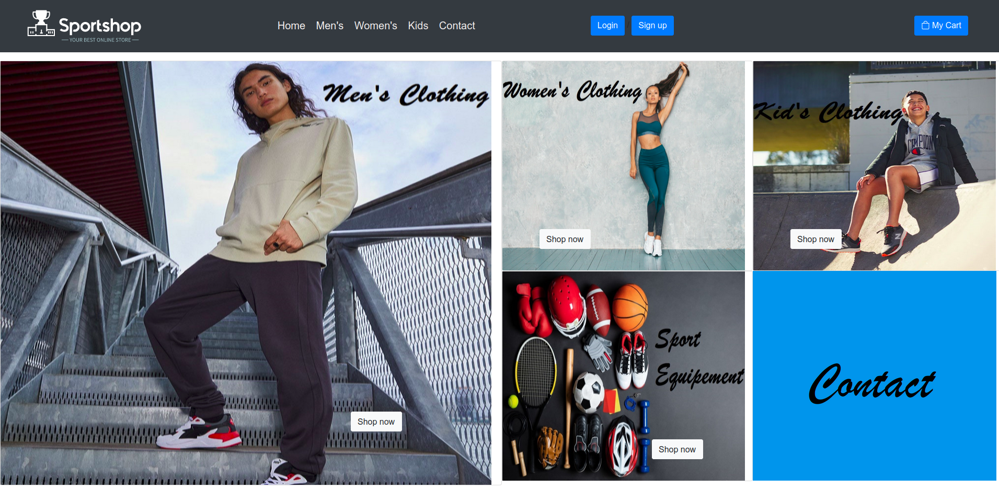

# SportShopEcommerce

This project involves the creation of an e-commerce website for the sale of sports tools. 
The website offers a variety of products for men, women, and children, as well as a category dedicated to sports equipment.  
The data is stored using firebase.

## Included Files

The project contains the following files:

- `home.html`: This page represents the homepage of the website. Visitors can find general information about the site and discover ongoing promotions.

- `men.html`: This page showcases the available products for men. Visitors can browse through a selection of sports tools specifically designed for them.

- `women.html`: This page is dedicated to products for women. Visitors can find a range of sports tools tailored to their needs.

- `kids.html`: This page offers a selection of sports tools for children. Visitors can explore products designed for young sports enthusiasts.

- `equipements.html`: This page presents the available sports equipment. Visitors can find items such as balls, rackets, gloves, etc.

- `log.html`: This page allows users to log in to the site using Firebase. They can enter their credentials to access the personalized user interface.

- `sign.html`: This page enables new users to create an account on the site by providing their personal information and choosing a username and password.

## Website Versions

To cater to the needs of different types of users, the project provides two versions of the main pages.

- **Non-logged-in Version**: These files correspond to the first version of the pages, where visitors can browse and purchase products without needing to log in. The files `home.html`, `men.html`, `women.html`, `kids.html`, and `equipements.html` are included in this version.

- **Logged-in Version**: These files correspond to the second version of the pages, where users need to log in to access a personalized user interface. The files `indexuser.html`, `menuser.html`, `womenuser.html`, `kidsuser.html`, `Equipementsuser.html`, `log.html`, and `sign.html` are included in this version.

## Deployment Instructions

To deploy this project on your web server, please follow these steps:

1. Ensure that your web server supports the execution of HTML, CSS, and JavaScript files.

2. Copy the mentioned files above to the root directory of your web server.

3. If you want to use the logged-in version, make sure you have set up Firebase with the appropriate credentials. You will need to update the login settings in the `log.html` and `sign.html` files with your own Firebase credentials.

4. Access the site using the URL corresponding to the homepage (`home.html`). You can then navigate to other pages using the available links.

